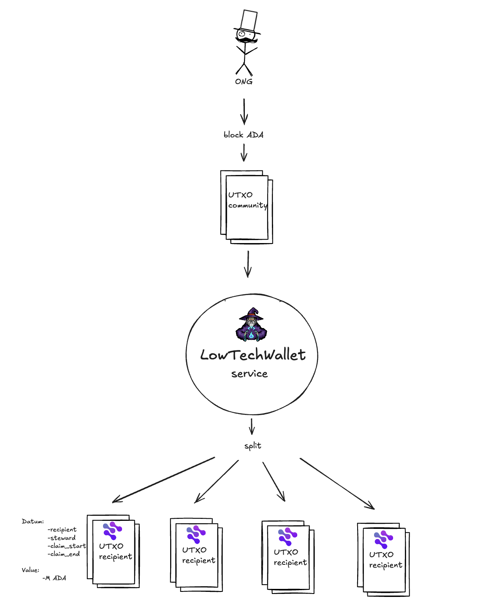
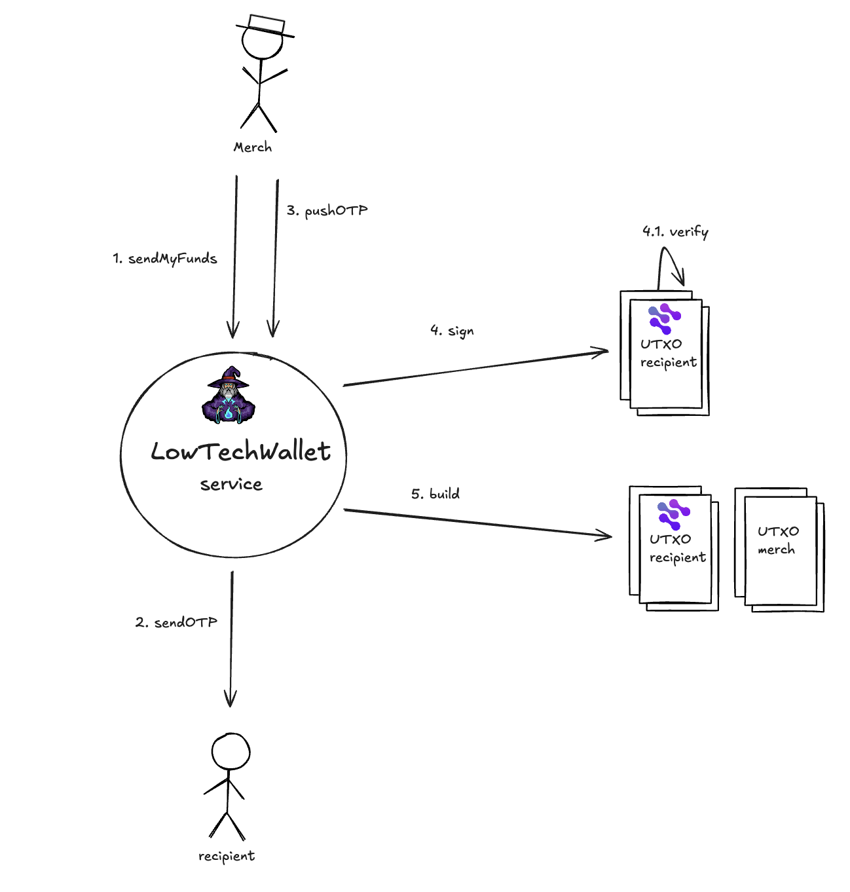

# 🛡️ Xcapit Offline Wallet on Cardano

## Overview  
**Xcapit Offline Wallet on Cardano** is an **open-source, SMS-enabled blockchain wallet** designed for users without internet or smartphones.  
The project enables **NGOs, governments, and humanitarian partners** to deliver **secure, transparent, and low-cost aid** at scale, using only basic feature phones.  

Unlike traditional wallets, this solution runs **fully offline**, bridging the digital divide and onboarding underserved communities into the Cardano ecosystem.  

---

## ✨ Key Features  
- **SMS-Based Wallet Creation & Management** → Programmatic setup of user wallets on Cardano via SMS, with sponsored initialization by NGOs.  
- **Fund Distribution via Smart Contracts (Aiken)** → Automated, transparent, and traceable distribution of funds.  
- **Sponsored Onboarding** → NGOs can pre-fund and activate wallets for beneficiaries.  
- **Offline Payments** → Merchants and users confirm transactions using SMS, without apps or internet.  
- **Partner Portal** → NGOs and partners can onboard beneficiaries, manage their **wallets**, and monitor fund traceability.
- **Open Source & DPG-Oriented** → Built as a **Digital Public Good** on Cardano.  

---

## 🎟️ Example Use Case

The **Xcapit Wallet System** manages community-distributed funds through a combination of **on-chain** (smart contracts on Cardano written in Aiken) and **off-chain** components the **Low-Tech Wallet (LTW) Service** with SMS integration.  
Each script-locked UTxO contains ADA and is controlled by a Validator that enforces spending conditions defined in the Datum.

### How It Works  
1. **Fund Aggregation** → Community funds are first pooled into a custodial UTxO managed by the LTW service.  

2. **Creation of Community & Individual UTxO** → Funds are bundled into **community UTxO pools** and then subdivided into **individual script-locked UTxOs**, each assigned to a specific recipient and validity window.

  

3. **Escrowed Funds Rules**:  
   - Only the assigned recipient can spend their funds during the validity window.  
   - If unspent upon expiry, the steward can reclaim the funds.  
   - Partial spends are supported by splitting UTxOs into **merchant payment + remaining balance**.  

4. **Transactions** → Facilitated via **OTP-based authentication over SMS**, ensuring accessibility for users without internet or mobile money.  

 

---

## 🚀 Roadmap / Milestones  
1. **Prototype (Month 2)**  
   - Core SMS wallet (wallet setup, transfers, sponsored onboarding).  
   - Transactions verifiable on Cardano testnet.  

2. **MVP (Month 4)**  
   - Partner portal + smart contracts in **Aiken**.  
   - Dashboard with real-time on-chain data.  

3. **Pilot (Month 6)**  
   - NGO pilot with 1–5K users.  
   - Target: **1,000+ successful transactions on Cardano mainnet**.  

4. **Technical Improvements & GTM (Month 7)**  
   - Release of **SDK/API open source** for Cardano developers.  
   - Go-to-market materials + partner integrations.  

---

## 🧩 Why Cardano?  
- **Low and predictable fees** → Scalable for millions of micro-transactions.  
- **Formal verification & security** → Safe fund management in high-stakes humanitarian contexts.  
- **Ecosystem alignment** → Integration with **Atala PRISM** for decentralized identity.  
- **Community-first approach** → Built with **Aiken smart contracts** to ensure developer accessibility and long-term sustainability.  

---

## 🔬 Cardano Technical Use Case  

### Actors  
- **NGO = Steward**  
- **Beneficiary = Recipient**  
- **LTW / SMS Service = Custodian & Transaction Facilitator**  

---

### 1. Converting Community UTxO to Escrowed Funds

**Context**: NGO allocates funds to a community.  
- ADA is locked into a community UTxO managed by the LTW service (fund custodian).
- This UTxO requires only the LTW service control key (no smart contract). 
- LTW Service subdivides the UTxO into individual script-locked UTxOs, each governed by a Validator script.

#### 1.1 Late Claim (via LTW Service)  
**Context**: Funds not consumed before expiry.  
- Steward initiates transaction.  
- Validator checks for steward’s signature and authorizes reclaim outside the validity window. 

---

### 2. Creation of Individual UTxO  
**Context**: Recipient receives a dedicated UTxO.  
- UTxO with a spend-type Validator.  

**Datum fields**:  
- Recipient (authorized spender address)  
- Steward (recovery address)  
- Validity start time  
- Expiration time  

**Validator logic**:  
- Spending must occur by the recipient within the validity window.  
- If expired, steward can reclaim funds.  

---

### 3. Escrowed Funds Redemption by Recipient  
**Context**: Recipient spends ADA at a merchant.  
- Merchant initiates payment request (e.g., 30 ADA).  
- Backend generates OTP and sends via SMS to recipient.  
- Recipient shares OTP with merchant → merchant enters OTP in portal.  
- Backend validates OTP and signs transaction via wallet.  
- Validator enforces spending rules, executing:  
  - Script-locked UTxO consumed.  
  - New UTxO → Merchant (purchase value).  
  - New Script-locked UTxO → Recipient (remaining balance, if any).  

#### 3.1 Partial Expenditure  
**Context**: Recipient spends less than total funds in their wallet.
- Recipient UTxO split into:  
  - Merchant UTxO (spent amount).  
  - Recipient Script-locked UTxO (remaining balance).  

---

## 📂 Repository Structure  
```bash
offline-wallet-cardano/
│── contracts/        # Aiken smart contracts
│── wallet-core/      # Core offline wallet logic
│── sms-gateway/      # SMS integration module
│── partner-portal/   # NGO partner management tools
│── docs/             # Documentation & guides
│── examples/         # Example scripts & demos